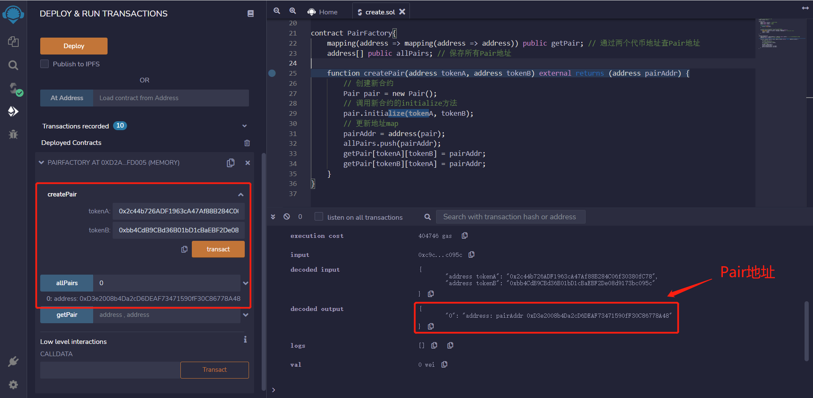
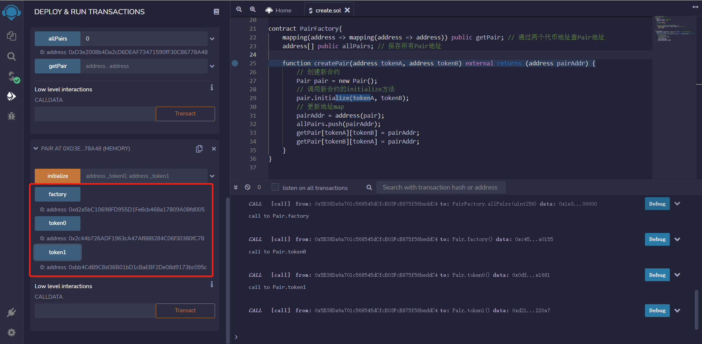
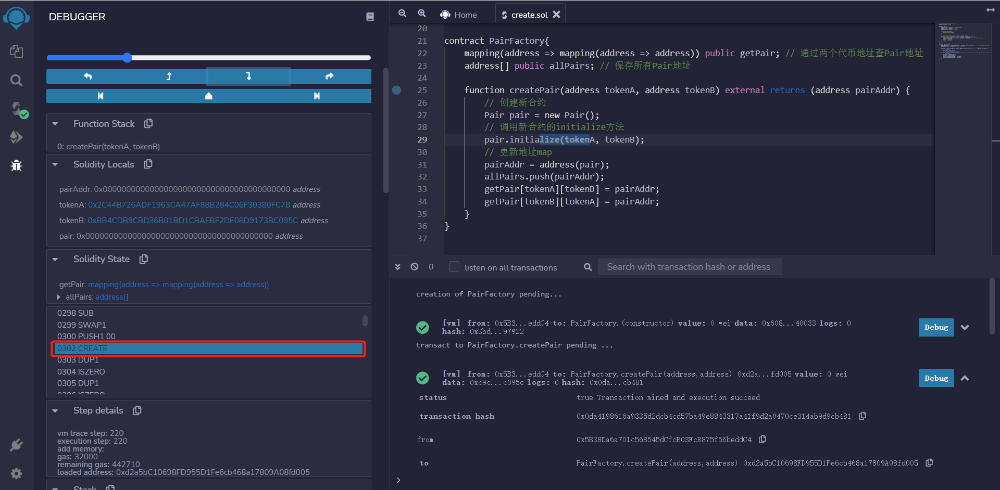

# WTF Solidity极简入门: 24. 在合约中创建新合约

我最近在重新学 Solidity，巩固一下细节，也写一个“WTF Solidity极简入门”，供小白们使用（编程大佬可以另找教程），每周更新 1-3 讲。

推特：[@0xAA_Science](https://twitter.com/0xAA_Science)｜[@WTFAcademy_](https://twitter.com/WTFAcademy_)

社区：[Discord](https://discord.gg/5akcruXrsk)｜[微信群](https://docs.google.com/forms/d/e/1FAIpQLSe4KGT8Sh6sJ7hedQRuIYirOoZK_85miz3dw7vA1-YjodgJ-A/viewform?usp=sf_link)｜[官网 wtf.academy](https://wtf.academy)

所有代码和教程开源在 github: [github.com/AmazingAng/WTF-Solidity](https://github.com/AmazingAng/WTF-Solidity)

---

在以太坊链上，用户（外部账户，`EOA`）可以创建智能合约，智能合约同样也可以创建新的智能合约。去中心化交易所`uniswap`就是利用工厂合约（`PairFactory`）创建了无数个币对合约（`Pair`）。这一讲，我会用简化版的`uniswap`讲如何通过合约创建合约。

## `create`

有两种方法可以在合约中创建新合约，`create`和`create2`，这里我们讲`create`，下一讲会介绍`create2`。

`create`的用法很简单，就是`new`一个合约，并传入新合约构造函数所需的参数：

```solidity
Contract x = new Contract{value: _value}(params)
```

其中`Contract`是要创建的合约名，`x`是合约对象（地址），如果构造函数是`payable`，可以创建时转入`_value`数量的`ETH`，`params`是新合约构造函数的参数。

## 极简Uniswap

`Uniswap V2`[核心合约](https://github.com/Uniswap/v2-core/tree/master/contracts)中包含两个合约：

1. UniswapV2Pair: 币对合约，用于管理币对地址、流动性、买卖。
2. UniswapV2Factory: 工厂合约，用于创建新的币对，并管理币对地址。

下面我们用`create`方法实现一个极简版的`Uniswap`：`Pair`币对合约负责管理币对地址，`PairFactory`工厂合约用于创建新的币对，并管理币对地址。

### `Pair`合约

```solidity
contract Pair{
    address public factory; // 工厂合约地址
    address public token0; // 代币1
    address public token1; // 代币2

    constructor() payable {
        factory = msg.sender;
    }

    // called once by the factory at time of deployment
    function initialize(address _token0, address _token1) external {
        require(msg.sender == factory, 'UniswapV2: FORBIDDEN'); // sufficient check
        token0 = _token0;
        token1 = _token1;
    }
}
```

`Pair`合约很简单，包含3个状态变量：`factory`，`token0`和`token1`。

构造函数`constructor`在部署时将`factory`赋值为工厂合约地址。`initialize`函数会由工厂合约在部署完成后手动调用以初始化代币地址，将`token0`和`token1`更新为币对中两种代币的地址。

> **提问**：为什么`uniswap`不在`constructor`中将`token0`和`token1`地址更新好？
>
> **答**：因为`uniswap`使用的是`create2`创建合约，生成的合约地址可以实现预测，更多详情请阅读[第25讲](https://github.com/AmazingAng/WTF-Solidity/blob/main/25_Create2/readme.md)。

### `PairFactory`

```solidity
contract PairFactory{
    mapping(address => mapping(address => address)) public getPair; // 通过两个代币地址查Pair地址
    address[] public allPairs; // 保存所有Pair地址

    function createPair(address tokenA, address tokenB) external returns (address pairAddr) {
        // 创建新合约
        Pair pair = new Pair(); 
        // 调用新合约的initialize方法
        pair.initialize(tokenA, tokenB);
        // 更新地址map
        pairAddr = address(pair);
        allPairs.push(pairAddr);
        getPair[tokenA][tokenB] = pairAddr;
        getPair[tokenB][tokenA] = pairAddr;
    }
}
```

工厂合约（`PairFactory`）有两个状态变量`getPair`是两个代币地址到币对地址的`map`，方便根据代币找到币对地址；`allPairs`是币对地址的数组，存储了所有代币地址。

`PairFactory`合约只有一个`createPair`函数，根据输入的两个代币地址`tokenA`和`tokenB`来创建新的`Pair`合约。其中

```solidity
Pair pair = new Pair(); 
```

就是创建合约的代码，非常简单。大家可以部署好`PairFactory`合约，然后用下面两个地址作为参数调用`createPair`，看看创建的币对地址是什么：

```text
WBNB地址: 0x2c44b726ADF1963cA47Af88B284C06f30380fC78
BSC链上的PEOPLE地址: 0xbb4CdB9CBd36B01bD1cBaEBF2De08d9173bc095c
```

### 在remix上验证

1. 使用`WBNB`和`PEOPLE`的地址作为参数调用`createPair`,得到`Pair`合约地址：0xD3e2008b4Da2cD6DEAF73471590fF30C86778A48

    
   
2. 将 Contract 改为 `Pair`，然后在 At Address 输入框输入 `Pair` 合约地址，创建一个前端接口用于调用已部署的合约。

    
   
3. 查看`Pair`合约变量

    
   
4. Debug查看`create`操作码

    

## 总结

这一讲，我们用极简`Uniswap`的例子介绍了如何使用`create`方法再合约里创建合约，下一讲我们将介绍如何使用`create2`方法来实现极简`Uniswap`。
