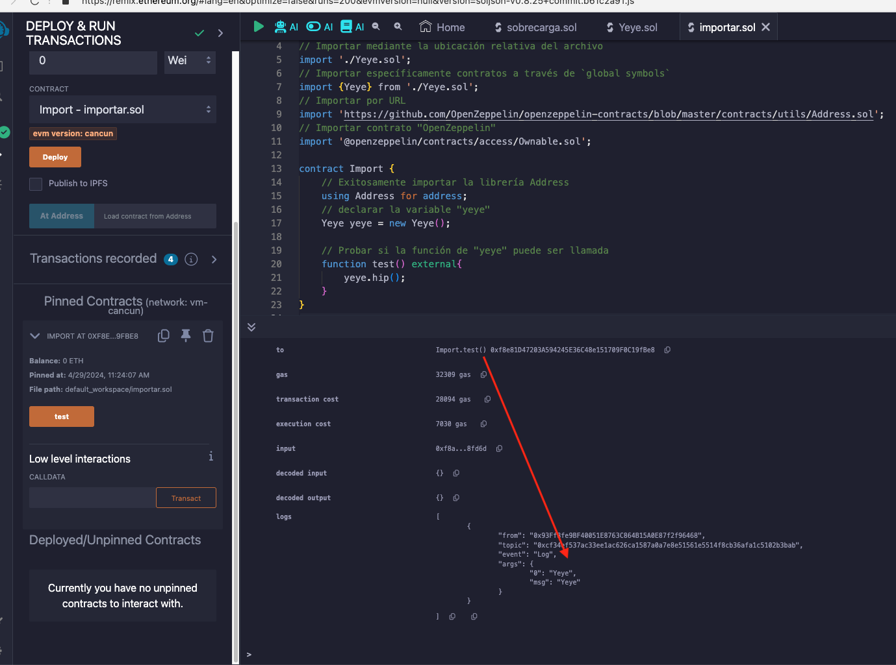

# Tutorial WTF Solidity: 18. Importar

Recientemente, he estado revisando Solidity y escribiendo tutoriales en "WTF Solidity" para principiantes.

Twitter: [@0xAA_Science](https://twitter.com/0xAA_Science) | [@WTFAcademy_](https://twitter.com/WTFAcademy_)

Comunidad: [Discord](https://discord.gg/5akcruXrsk)｜[Wechat](https://docs.google.com/forms/d/e/1FAIpQLSe4KGT8Sh6sJ7hedQRuIYirOoZK_85miz3dw7vA1-YjodgJ-A/viewform?usp=sf_link)｜[Sitio web wtf.academy](https://wtf.academy)

La traducción al español ha sido realizada por Jonathan Díaz con el objetivo de hacer estos recursos accesibles a la comunidad de habla hispana.

Twitter: [@jonthdiaz](https://twitter.com/jonthdiaz)

Los códigos y tutoriales están como código abierto en GitHub: [github.com/AmazingAng/WTFSolidity](https://github.com/AmazingAng/WTFSolidity)

-----

`solidity` soporta el uso de la palabra clave `import` para importar símbolos globales en otros contratos
(simplemente entendido como código fuente externo), lo que hace que el desarrollo sea más modular. Generalmente,
si no se especifica, todos los símbolos globales del archivo importado se importarán al ámbito global actual.

## Uso de `import`

- Importar por ubicación relativa del archivo fuente. Por ejemplo:

```solidity
Jerarquía
├── Import.sol
└── Yeye.sol

// Importar por ubicación relativa del archivo fuente
import './Yeye.sol';
```

- Importar los símbolos globales de los contratos en Internet a través de la URL del archivo fuente. Por ejemplo:
```solidity
// Importar por URL
import 'https://github.com/OpenZeppelin/openzeppelin-contracts/blob/master/contracts/utils/Address.sol';
```

- Importar a través del directorio `npm`. Por ejemplo:
```solidity
import '@openzeppelin/contracts/access/Ownable.sol';
```

- Importar símbolos globales específicos del contrato especificando `símbolos globales`. Por ejemplo:
```solidity
import {Yeye} from './Yeye.sol';
```

- El lugar de la referencia (`import`) en el código: después de declarar la versión, antes del resto del código.

## Prueba de `import`

Se puede usar el siguiente código para probar si el código fuente externo se importó correctamente:

```solidity
contract Import {
    // Importar correctamente la biblioteca Address
    using Address for address;
    // Declarar la variable "yeye"
    Yeye yeye = new Yeye();

    // Probar si se puede llamar a la función de "yeye"
    function test() external{
        yeye.hip();
    }
}
```



## Resumen
En esta lección, presentamos el método de importación de código fuente externo usando la palabra clave `import`. A través de `import`,
puede hacer referencia a contratos o funciones en otros archivos escritos por nosotros,
o importar directamente código escrito por otros, lo cual es muy conveniente.
