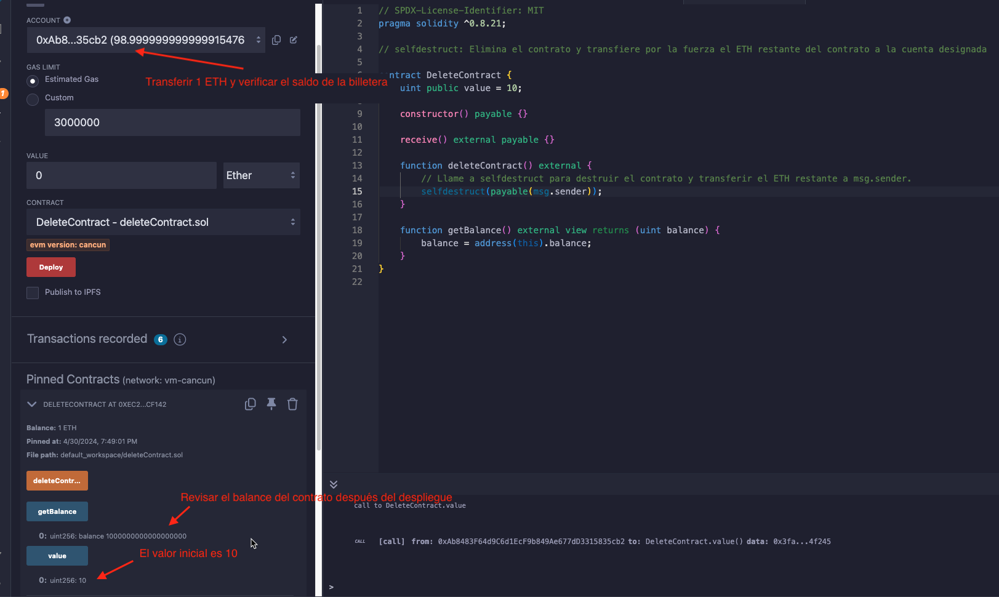
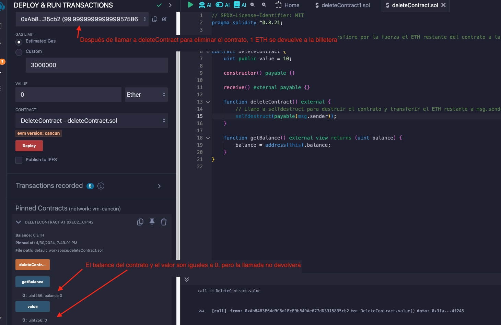

# Tutorial WTF Solidity: 26. Eliminar contrato

Recientemente, he estado revisando Solidity y escribiendo tutoriales en "WTF Solidity" para principiantes.

Twitter: [@0xAA_Science](https://twitter.com/0xAA_Science) | [@WTFAcademy_](https://twitter.com/WTFAcademy_)

Comunidad: [Discord](https://discord.gg/5akcruXrsk)｜[Wechat](https://docs.google.com/forms/d/e/1FAIpQLSe4KGT8Sh6sJ7hedQRuIYirOoZK_85miz3dw7vA1-YjodgJ-A/viewform?usp=sf_link)｜[Sitio web wtf.academy](https://wtf.academy)

La traducción al español ha sido realizada por Jonathan Díaz con el objetivo de hacer estos recursos accesibles a la comunidad de habla hispana.

Twitter: [@jonthdiaz](https://twitter.com/jonthdiaz)

Los códigos y tutoriales están como código abierto en GitHub: [github.com/AmazingAng/WTFSolidity](https://github.com/AmazingAng/WTFSolidity)
---

## `selfdestruct`

La operación `selfdestruct` es la única forma de eliminar un contrato inteligente y el `ETH` restante almacenado en esa dirección se envía a un destino designado. La operación `selfdestruct` está diseñada para tratar con casos extremos de errores de contrato. Originalmente, el opcode se llamaba `suicide`, pero la comunidad de Ethereum decidió cambiarlo a `selfdestruct` porque el suicidio es un tema pesado y se debe hacer todo lo posible para no ser insensibles a los programadores que sufren de depresión.

### Cómo usar `selfdestruct`

Es simple usar `selfdestruct`：
```solidity
selfdestruct(_addr);
```

`_addr` es la dirección para almacenar el `ETH` restante en el contrato.

### Ejemplo:

```solidity
contract DeleteContract {

    uint public value = 10;

    constructor() payable {}

    receive() external payable {}

    function deleteContract() external {
        // usar selfdestruct para eliminar el contrato y enviar el ETH restante a msg.sender
        selfdestruct(payable(msg.sender));
    }

    function getBalance() external view returns(uint balance){
        balance = address(this).balance;
    }
}
```

En `DeleteContract`, se define una variable de estado pública llamada `value` y dos funciones: `getBalance()` que se utilizan para obtener el saldo de `ETH` del contrato, `deleteContract()` que se utiliza para eliminar el contrato y transferir el `ETH` restante al remitente del mensaje.

Después de desplegar el contrato, se envía 1 ETH al contrato. El resultado debería ser 1 ETH cuando se llama a `getBalance()`  el `value` debería ser 10.

Luego se llame a `deleteContract().` El contrato se autodestruirá y todas las variables se borrarán. En este momento, `value` es igual a `0` que es el valor predeterminado, y `getBalance()` también devuelve un valor vacío.

### Atención

1. Al proporcionar la función de destrucción del contrato externamente, es mejor declarar la función para que solo pueda ser llamada por el propietario del contrato, como usar el modificador de función `onlyOwner`.
2. Cuando el contrato se destruye, la interacción con el contrato inteligente también puede tener éxito y devolver `0`.
3. A menudo surgen problemas de seguridad y confianza cuando un contrato incluye una función `selfdestruct`. Esta característica abre vectores de ataque para posibles atacantes. Por ejemplo, los atacantes podrían explotar `selfdestruct` para transferir tokens a un contrato con frecuencia, reduciendo significativamente el costo de gas para atacar. Aunque esta táctica no se emplea comúnmente, sigue siendo una preocupación. Además, la presencia de la función `selfdestruct` puede disminuir la confianza de los usuarios en el contrato. 

### Ejemplo de Remix

1. Desplegar el contrato y envía 1 ETH al contrato. Comprobar el estado del contrato. 



2. Eliminar el contrato y comprobar el estado del contrato.



Al examinar el estado del contrato, se observa que el ETH se transfiere a la dirección especificada solo después de que el contrato se ha destruido. Sin embargo, incluso después de la eliminación del contrato, aún es posible interactuar con él. Por lo tanto, la simple capacidad de interacción no confirma si el contrato ha sido efectivamente destruido.


## Resumen
`selfdestruct` es el botón de emergencia para los contratos inteligentes. Eliminará el contrato y transferirá el `ETH` restante a la cuenta designada. Cuando ocurrió el famoso hackeo de `The DAO`, los fundadores de Ethereum deben haber lamentado no haber agregado `selfdestruct` al contrato para detener el ataque del hacker.
