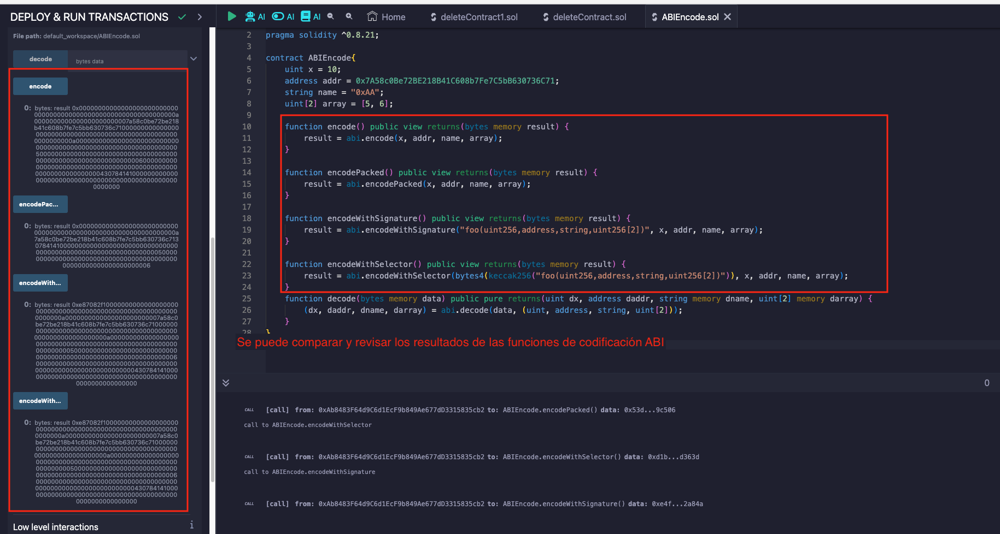

# Tutorial WTF Solidity: 27. Codificación y Decodificación ABI

Recientemente, he estado revisando Solidity y escribiendo tutoriales en "WTF Solidity" para principiantes.

Twitter: [@0xAA_Science](https://twitter.com/0xAA_Science) | [@WTFAcademy_](https://twitter.com/WTFAcademy_)

Comunidad: [Discord](https://discord.gg/5akcruXrsk)｜[Wechat](https://docs.google.com/forms/d/e/1FAIpQLSe4KGT8Sh6sJ7hedQRuIYirOoZK_85miz3dw7vA1-YjodgJ-A/viewform?usp=sf_link)｜[Sitio web wtf.academy](https://wtf.academy)

La traducción al español ha sido realizada por Jonathan Díaz con el objetivo de hacer estos recursos accesibles a la comunidad de habla hispana.

Twitter: [@jonthdiaz](https://twitter.com/jonthdiaz)

Los códigos y tutoriales están como código abierto en GitHub: [github.com/AmazingAng/WTFSolidity](https://github.com/AmazingAng/WTFSolidity)

-----

`ABI`(Application Binary Interface) es el estándar para interactuar con contratos inteligentes de Ethereum. Los datos se codifican en función de su tipo, y debido a que el resultado codificado no contiene información de tipo, es necesario indicar sus tipos al decodificarlos.

En Solidity, `ABI encode` tiene cuatro funciones: `abi.encode`, `abi.encodePacked`, `abi.encodeWithSignature`, `abi.encodeWithSelector`. Mientras que `ABI decode` tiene una función: `abi.decode`, que se utiliza para decodificar los datos de `abi.encode`.

En este capítulo, aprenderemos cómo usar estas funciones.

## Codificación ABI
Codificaremos cuatro variables, sus tipos son `uint256` (alias `uint`), `address`, `string`, `uint256[2]`:
```solidity
    uint x = 10;
    address addr = 0x7A58c0Be72BE218B41C608b7Fe7C5bB630736C71;
    string name = "0xAA";
    uint[2] array = [5, 6]; 
```
### `abi.encode`
Utilizamos las [reglas ABI](https://learnblockchain.cn/docs/solidity/abi-spec.html) para codificar los parámetros dados. `ABI` está diseñado para interactuar con contratos inteligentes llenando cada parámetro con datos de 32 bytes y concatenándolos. Si deseas interactuar con contratos, debes usar `abi.encode`.
```solidity
    function encode() public view returns(bytes memory result) {
        result = abi.encode(x, addr, name, array);
    }
```
El resultado de la codificación es `0x000000000000000000000000000000000000000000000000000000000000000a0000000000000000000000007a58c0be72be218b41c608b7fe7c5bb630736c7100000000000000000000000000000000000000000000000000000000000000a00000000000000000000000000000000000000000000000000000000000000005000000000000000000000000000000000000000000000000000000000000000600000000000000000000000000000000000000000000000000000000000000043078414100000000000000000000000000000000000000000000000000000000`. Dado que `abi.encode` llena cada dato con 32 bytes de datos, hay muchos `0` en el medio.

### `abi.encodePacked`

Codifica los parámetros dados de acuerdo con el espacio mínimo requerido. Es similar a `abi.encode`, pero omite muchos `0` rellenados. Por ejemplo, solo se usa 1 byte para codificar el tipo `uint`. Puedes usar `abi.encodePacked` cuando deseas ahorrar espacio y no interactuar con contratos. Por ejemplo, al calcular el `hash` de algunos datos.
```solidity
    function encodePacked() public view returns(bytes memory result) {
        result = abi.encodePacked(x, addr, name, array);
    }
```
El resultado de la codificación es `0x000000000000000000000000000000000000000000000000000000000000000a7a58c0be72be218b41c608b7fe7c5bb630736c713078414100000000000000000000000000000000000000000000000000000000000000050000000000000000000000000000000000000000000000000000000000000006`. Debido a que `abi.encodePacked` compacta la codificación, la longitud del resultado es mucho más corta que `abi.encode`.

### `abi.encodeWithSignature`
Similar a la función `abi.encode`, el primer parámetro es `firmas de función`, como `"foo(uint256, address, string, uint256[2])"`. Se puede usar al llamar a otros contratos.
```solidity
    function encodeWithSignature() public view returns(bytes memory result) {
        result = abi.encodeWithSignature("foo(uint256,address,string,uint256[2])", x, addr, name, array);
    }
```
El resultado de la codificación es `0xe87082f1000000000000000000000000000000000000000000000000000000000000000a0000000000000000000000007a58c0be72be218b41c608b7fe7c5bb630736c7100000000000000000000000000000000000000000000000000000000000000a00000000000000000000000000000000000000000000000000000000000000005000000000000000000000000000000000000000000000000000000000000000600000000000000000000000000000000000000000000000000000000000000043078414100000000000000000000000000000000000000000000000000000000`. Esto es equivalente a agregar 4 bytes `selector de función` al frente del resultado de `abi.encode`[^nota].
[^nota]: Los selectores de función identifican funciones por su firma procesada (Keccak–Sha3) usando nombres de funciones y argumentos, que se pueden utilizar para llamadas de función entre diferentes contratos.

### `abi.encodeWithSelector`
Similar a `abi.encodeWithSignature`, excepto que el primer argumento es un `selector de función`, los primeros 4 bytes del `hash Keccak` de la `firma de función`.
```solidity
    function encodeWithSelector() public view returns(bytes memory result) {
        result = abi.encodeWithSelector(bytes4(keccak256("foo(uint256,address,string,uint256[2])")), x, addr, name, array);
    }
```

El resultado de la codificación es `0xe87082f1000000000000000000000000000000000000000000000000000000000000000a0000000000000000000000007a58c0be72be218b41c608b7fe7c5bb630736c7100000000000000000000000000000000000000000000000000000000000000a00000000000000000000000000000000000000000000000000000000000000005000000000000000000000000000000000000000000000000000000000000000600000000000000000000000000000000000000000000000000000000000000043078414100000000000000000000000000000000000000000000000000000000`. El resultado es el mismo que `abi.encodeWithSignature`.

## Decodificación ABI
### `abi.decode`
`abi.decode` se utiliza para decodificar el código binario generado por `abi.encode` y restaurarlo a sus parámetros originales.
```solidity
    function decode(bytes memory data) public pure returns(uint dx, address daddr, string memory dname, uint[2] memory darray) {
        (dx, daddr, dname, darray) = abi.decode(data, (uint, address, string, uint[2]));
    }
```
Ingresamos la codificación binaria de `abi.encode` en `decode`, que decodificará los parámetros originales:


## Verificación en Remix
- Desplegar el contrato para verificar el resultado de la codificación de `abi.encode` 


- comparar y verificar las similitudes y diferencias de las cuatro funciones de codificación


- verificar el resultado de decodificación de `abi.decode`


## Escenario de uso de ABI 
1. En el desarrollo de contratos, `ABI` a menudo se combina con una llamada para implementar una llamada de bajo nivel al contrato.
```solidity  
    bytes4 selector = contract.getValue.selector;

    bytes memory data = abi.encodeWithSelector(selector, _x);
    (bool success, bytes memory returnedData) = address(contract).staticcall(data);
    require(success);

    return abi.decode(returnedData, (uint256));
``
2. ABI se usa a menudo en ethers.js para implementar la importación de contratos y llamadas de funciones.
```solidity
    const wavePortalContract = new ethers.Contract(contractAddress, contractABI, signer);
    /*
        * Llama al método getAllWaves de tu contrato inteligente
        */
    const waves = await wavePortalContract.getAllWaves();
```
3. Después de descompilar un contrato que no es de código abierto, algunas funciones no pueden encontrar firmas de función, pero se pueden llamar a través de `ABI`.
- 0x533ba33a() es una función que se muestra después de descompilar, solo se pueden obtener resultados codificados de funciones, y no se puede encontrar la firma de la función.


- En este caso no podemos llamar a través de la construcción de una interfaz o contrato


En este caso, podemos llamar a través del selector de función ABI.
```solidity
    bytes memory data = abi.encodeWithSelector(bytes4(0x533ba33a));

    (bool success, bytes memory returnedData) = address(contract).staticcall(data);
    require(success);

    return abi.decode(returnedData, (uint256));
```

## Resumen
En Ethereum, los datos deben codificarse en bytecode para interactuar con contratos inteligentes. En este capítulo, se presentaron cuatro funciones de `codificación ABI` y una función de `decodificación ABI`.
