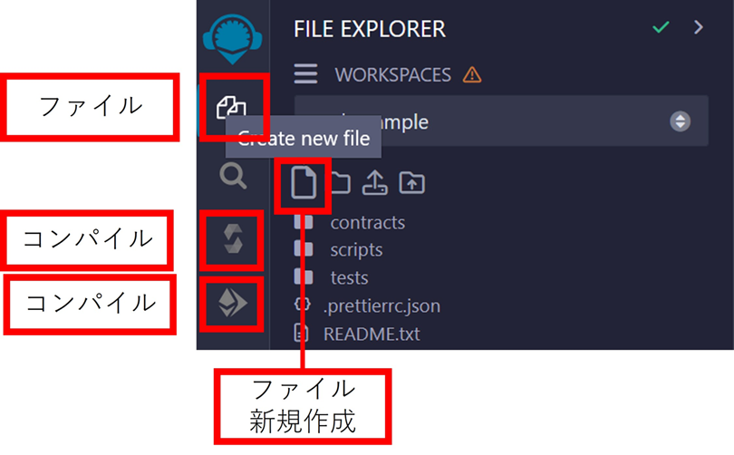
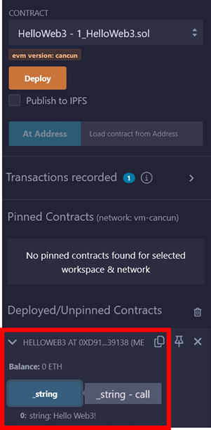

# WTF Solidity Tutorial: 1. HelloWeb3 (Solidity in 3 lines)

最近、Solidity の学習を再開し、詳細を確認しながら「Solidity 超シンプル入門」を作っています。これは初心者向けのガイドで、プログラミングの達人向けの教材ではありません。毎週 1〜3 レッスンのペースで更新していきます。

僕のツイッター：[@0xAA_Science](https://twitter.com/0xAA_Science)｜[@WTFAcademy\_](https://twitter.com/WTFAcademy_)

コミュニティ：[Discord](https://discord.gg/5akcruXrsk)｜[Wechat](https://docs.google.com/forms/d/e/1FAIpQLSe4KGT8Sh6sJ7hedQRuIYirOoZK_85miz3dw7vA1-YjodgJ-A/viewform?usp=sf_link)｜[公式サイト wtf.academy](https://wtf.academy)

すべてのソースコードやレッスンは github にて公開: [github.com/AmazingAng/WTFSolidity](https://github.com/AmazingAng/WTFSolidity)

-----

## Solidityとは?

`Solidity` はEVM(Ethereum Virtual Machine)上でスマートコントラクトを作成する為に使われるプログラミング言語です。ブロックチェーンのプロジェクトで仕事を行う上で不可欠なスキルであり、それに加えて、その多くがオープンソースである為、コードを理解することによって赤字プロジェクトとなることを避けることに役立ちます。


`Solidity` が持つ2つの特徴:

1. オブジェクト指向: Solidityを身に付けた後、適切なプロジェクトを探し出すことでお金を稼ぐことが出来るようになります。
3. 上級者向け: Solidityでスマートコントラクトを書くことが出来れば、 Ethereumの世界で第一級の市民権を得ることが出来ます。

## 開発者ツール: Remix

このチュートリアルでは、`solidity`のコントラクトを実行する為に、`Remix`を使用します。`Remix`とはEthereum公式が推奨しているスマートコントラクト統合開発環境(IDE)のことです。初心者に適しており、ローカルPCに何もプログラムをインストールすることなく、素早くデプロイしてブラウザ内でスマートコントラクトをテストすることが出来ます。

Website: [remix.ethereum.org](https://remix.ethereum.org)

`Remix`に入ると、左側のメニューに、ファイル（コードを書く場所）、コンパイル（コードを実行する場所）、デプロイ（ブロックチェーン上にデプロイする場所）の3つのボタンがあることが分かります。"Create New File"ボタンをクリックすることで、空の`solidity`コントラクトを作成することが出来ます。

Remixに入ると、左端の垂直メニューに、FILE EXPLORER (コードを書く場所)、SEARCH IN FILES (ファイルを検索したり置換したりする場所)、SOLIDITY COMPILER (コードを実行する場所)、そしてDEPLOY & RUN TRANSACTIONS (オンチェーンに対してのデプロイを行う場所)があることがわかります。 "Create New File"ボタンをクリックすることで、空の`solidity`コントラクトを作成することが出来ます。



## はじめてのSolidityプログラム

これは1行のコメントと3行のコードのみを含む簡単なプログラムです。

```solidity
// SPDX-License-Identifier: MIT
pragma solidity ^0.8.21;
contract HelloWeb3{
    string public _string = "Hello Web3!";}
```

次に、ソースコードを詳細に分解して分析し、基本的な構造を理解していきます。

1. 最初の行はコメントです。プログラムによって使用されているソフトウェアライセンス（ライセンス識別子）を示しています。MITライセンスを使うことにします。もし、使用されているライセンスを記載しなかった場合、プログラムは上手くコンパイルが出来るのですが、コンパイルの最中に警告が表示されます。Solidityのコメントは"//"で示され、その後にコメントの内容が続きます（プログラムによって実行されることはありません）。

```solidity
// SPDX-License-Identifier: MIT
```

2. 第一に、2行目はソースファイルによって使用されているSolidityのバージョンを宣言しています。というのも、バージョンによって文法が異なっているからです。このコードの行はソースファイルが0.8.21未満または0.9.0以上バージョンのコンパイラーでコンパイルを許可しないことを意味しています（最初の0.8.21以上はコンパイルを許可するという条件は`^`によって提供されます）。Solidityステートメントはセミコロン(;)で終了します。


```solidity
pragma solidity ^0.8.21;
```
    
3. 3行目と4行目はスマートコントラクトの本体です。3行目は`HelloWeb3`という名前でコントラクトを作成しています。4行目に関しては、コントラクトの内容です。ここでは、`_string`と呼ばれる文字列型の変数を作成し、その値として"Hello Web3!"を割り当てています。 

```solidity
contract HelloWeb3{
    string public _string = "Hello Web3!";}
```
後ほど、Solidityにある様々な変数を紹介しますね。

## コードのコンパイルとデプロイ

コードエディターで、CTRL+Sを行い、コードをコンパイルします。

コンパイルした後で、左側のメニューにある`Deploy`ボタンをクリックしてデプロイのページに入ってください。

   

デフォルトでは、Remixはブラウザ上でテストネットを実行するのと同様に、JavaScript仮想マシンをしようしてEthereumチェーンをシミュレートしてスマートコントラクトを実行します。Remixはそれぞれに100ETH（テスト用のトークン）を持つ、幾つかのテスト用アカウントをあなたに割り当てます。`Deploy`（黄色のボタン）をクリックしてコントラクトをデプロイすることが出来ます。

   
   
デプロイが成功すれば、`HelloWeb3`という名前のコントラクトが下の方に出てくることが分かります。`_string`という変数をクリックすることで、その値を表示させます：`Hello Web3!"。

## 要約

このチュートリアルでは、簡単に`Solidity`、`Remix` IDEを紹介し、最初のSolidityのプログラム`HelloWeb3`を完成させました。今後も、Solidityの旅を続けていきます。

### 推奨されるSolidityに関する資料：

1. [Solidity Documentation](https://docs.soliditylang.org/en/latest/)
2. [Solidity Tutorial by freeCodeCamp](https://www.youtube.com/watch?v=ipwxYa-F1uY)
