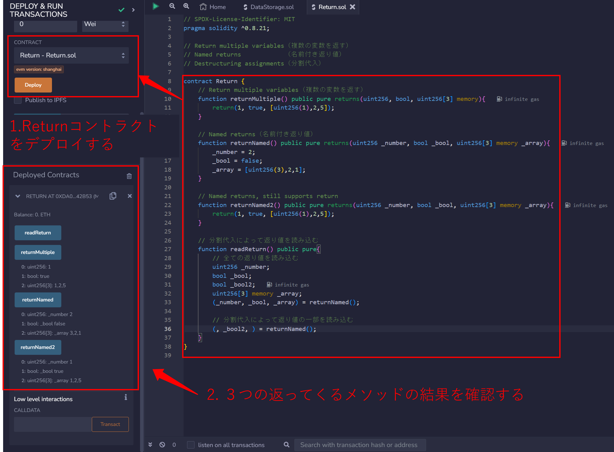

# WTF Solidity 超シンプル入門: 4. Function Output（関数出力）

最近、Solidity の学習を再開し、詳細を確認しながら「Solidity 超シンプル入門」を作っています。これは初心者向けのガイドで、プログラミングの達人向けの教材ではありません。毎週 1〜3 レッスンのペースで更新していきます。

僕のツイッター：[@0xAA_Science](https://twitter.com/0xAA_Science)｜[@WTFAcademy\_](https://twitter.com/WTFAcademy_)

コミュニティ：[Discord](https://discord.gg/5akcruXrsk)｜[Wechat](https://docs.google.com/forms/d/e/1FAIpQLSe4KGT8Sh6sJ7hedQRuIYirOoZK_85miz3dw7vA1-YjodgJ-A/viewform?usp=sf_link)｜[公式サイト wtf.academy](https://wtf.academy)

すべてのソースコードやレッスンは github にて公開: [github.com/AmazingAng/WTFSolidity](https://github.com/AmazingAng/WTFSolidity)

-----

この章では、`Solidity`の関数出力を紹介します。複数の値を返したり名前付きで返したり、分割代入を用いて返り値の全部もしくは一部を読み込んだりします。

## Return values（返り値） (return と returns)
関数出力に関連する２つのキーワードがあります: `return` と `returns`です:
- `returns`は変数の型と変数の名前を宣言する為に関数名の後に付加されます。
- `return`は関数本体で使用され、予期された変数を返します。

```solidity
    // returning multiple variables
    function returnMultiple() public pure returns(uint256, bool, uint256[3] memory){
            return(1, true, [uint256(1),2,5]);
        }
```
上記のソースコードで`returnMultiple()`関数は複数の出力値を持ちます: `returns (uint256, bool, uint256[3] memory)`、そして`return (1, true, [uint256 (1), 2,5])`によって関数の本体で返す変数と返り値を指定します。

## Named returns（名前付き返り値）
`returns`では返り値となる変数の名前を表明することができます。そうすることで、`solidity`は自動的にこれらの変数を初期化し、そして`return`キーワードを付与することなくこれらの関数の値を自動的に返すことができるようになります。

```solidity
    // named returns
    function returnNamed() public pure returns(uint256 _number, bool _bool, uint256[3] memory _array){
        _number = 2;
        _bool = false; 
        _array = [uint256(3),2,1];
    }
```

上記のソースコードでは、`returns (uint256 _number, bool _bool, uint256[3] memory _array) `で返り値となる変数の型と変数名を宣言しています。従って、関数本体で変数`_number`や`_bool`、` _array `に値を代入するだけで良く、それらは自動的に関数によって戻されます。

勿論、名前付き返り値に`return`キーワードを用いることによって変数を返すことも出来ます:
```solidity
    // Named return, still support return
    function returnNamed2() public pure returns(uint256 _number, bool _bool, uint256[3] memory _array){
        return(1, true, [uint256(1),2,5]);
    }
```
## Destructuring assignments（分割代入）
`Solidity`は内部的にタプル型、つまり潜在的に様々な型のオブジェクトのリスト（コンパイル時にその個数が定数）を許容しています。タプル型は同時に複数の値を返すのに使えます。

- 次のソースコードでは、変数は型宣言され、返り値としてのタプルが代入されます。全ての要素が指定される必要はありませんが、個数は一致していなければなりません:
```solidity
        uint256 _number;
        bool _bool;
        uint256[3] memory _array;
        (_number, _bool, _array) = returnNamed();
```
- 返り値の一部を代入するケースです: Components can be left out.次のソースコードでは、返り値を` _bool2 `にだけ代入しており、` _number `と` _array `には代入していません:
```solidity
        (, _bool2, ) = returnNamed();
```

## Verify on Remix（Remixによる検証）
- コントラクトをデプロイして関数の返り値をチェックしてみましょう:




## 要約
この章では、関数の返り値を設定する際に用いる`return`と`returns`を紹介しました。そして、その中には、複数の変数や名前付き返り値、分割代入による全部或いは一部の返り値の読み込みがありました。


