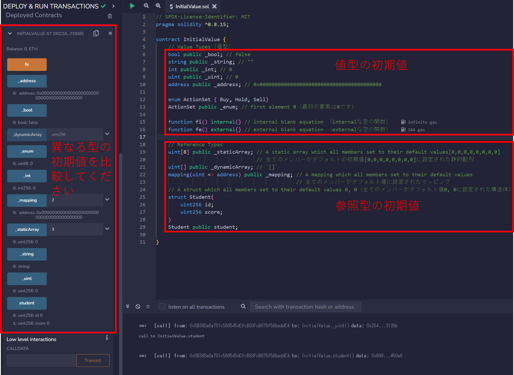
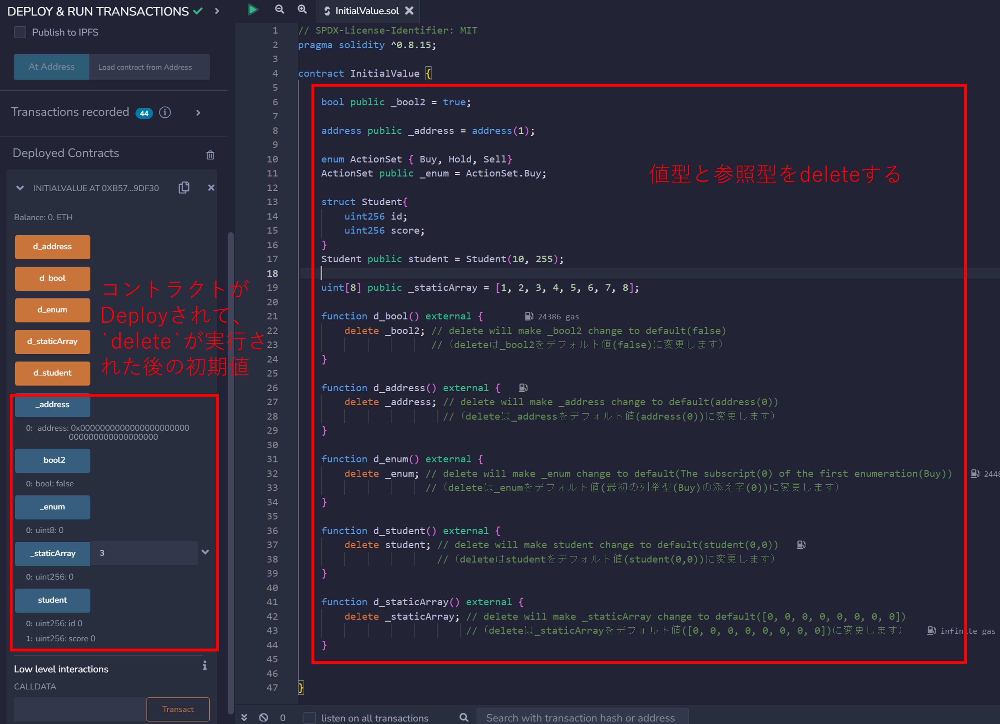

# WTF Solidity 超シンプル入門: 8. Initial Value （初期値）

最近、Solidity の学習を再開し、詳細を確認しながら「Solidity 超シンプル入門」を作っています。これは初心者向けのガイドで、プログラミングの達人向けの教材ではありません。毎週 1〜3 レッスンのペースで更新していきます。

僕のツイッター：[@0xAA_Science](https://twitter.com/0xAA_Science)｜[@WTFAcademy\_](https://twitter.com/WTFAcademy_)

コミュニティ：[Discord](https://discord.gg/5akcruXrsk)｜[Wechat](https://docs.google.com/forms/d/e/1FAIpQLSe4KGT8Sh6sJ7hedQRuIYirOoZK_85miz3dw7vA1-YjodgJ-A/viewform?usp=sf_link)｜[公式サイト wtf.academy](https://wtf.academy)

すべてのソースコードやレッスンは github にて公開: [github.com/AmazingAng/WTFSolidity](https://github.com/AmazingAng/WTFSolidity)

-----

## Initial values of variables　（変数の初期値）

Solidityにおいて、宣言されているが代入されていない変数については初期値/デフォルト値を持っています。このチュートリアルでは、一般的な変数型の初期値を紹介します。

### Initial values of value types

- `boolean`: `false`
- `string`: `""`
- `int`: `0`
- `uint`: `0`
- `enum`: 列挙型の最初の要素 
- `address`: `0x0000000000000000000000000000000000000000` (or `address(0)`)
- `function`
    - `internal`: 空の関数
    - `external`: 空の関数

上記の初期値を確認するには、`public`変数の`getter`関数を使用します:

```solidity
    bool public _bool; // false
    string public _string; // ""
    int public _int; // 0
    uint public _uint; // 0
    address public _address; // 0x0000000000000000000000000000000000000000

    enum ActionSet {Buy, Hold, Sell}
    ActionSet public _enum; // first element 0

    function fi() internal{} // internal blank function
    function fe() external{} // external blank function
```

### Initial values of reference types （参照型の初期値）

- `mapping`: 全てのメンバーが初期値に設定された`mapping`「mappingが作成されると、任意のキーに対して（キーは全ての組み合わせが想定されている）初期値がマッピングされている」
- `struct`: 全てのメンバーが初期値に設定された`struct`「structが作成されると、全てのメンバーがそれぞれの型のデフォルト値に設定される」

- `array`
    - 動的配列: `[]`
    - 静的配列（固定長): 全てのメンバーが初期値に設定された静的配列

初期値を確認するには、`public`変数の`getter`関数を使用します:

```solidity
    // reference types
    uint[8] public _staticArray; // a static array which all members set to their default values[0,0,0,0,0,0,0,0]
    uint[] public _dynamicArray; // `[]`
    mapping(uint => address) public _mapping; // a mapping which all members set to their default values
    // a struct in which all members are set to their default values of 0, 0
    struct Student{
        uint256 id;
        uint256 score; 
    }
    Student public student;
```

### `delete` operator （`delete`演算子）

`delete a`は変数`a`の値をその初期値に変更することができます。

```solidity
    // delete operator
    bool public _bool2 = true; 
    function d() external {
        delete _bool2; // delete will make _bool2 change to default(false)
    }
```

## Verify on Remix （Remixによる検証）

- `InitialValue.sol`をデプロイして様々な型の初期値をチェックしてみましょう

    

- `delete`演算子を使用した後で、変数の値は初期値にリセットされます。

    

## Summary

この章では、Solidityにおける変数の初期値を紹介しました。変数が宣言されたにも拘らず代入されていない場合には、その値はデフォルトで初期値に設定されており、そしてそれはその型で表される`0`に等しくなります。`delete`演算子は変数の値を初期値にリセット出来ます。
