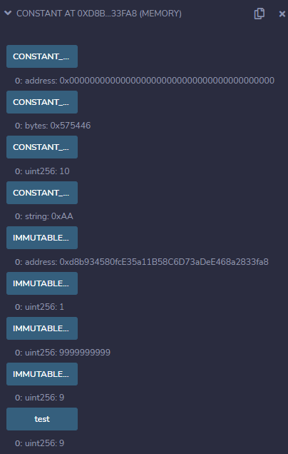

# WTF Solidity 超シンプル入門: 9. Constant and Immutable （定数と不変）

最近、Solidity の学習を再開し、詳細を確認しながら「Solidity 超シンプル入門」を作っています。これは初心者向けのガイドで、プログラミングの達人向けの教材ではありません。毎週 1〜3 レッスンのペースで更新していきます。

僕のツイッター：[@0xAA_Science](https://twitter.com/0xAA_Science)｜[@WTFAcademy\_](https://twitter.com/WTFAcademy_)

コミュニティ：[Discord](https://discord.gg/5akcruXrsk)｜[Wechat](https://docs.google.com/forms/d/e/1FAIpQLSe4KGT8Sh6sJ7hedQRuIYirOoZK_85miz3dw7vA1-YjodgJ-A/viewform?usp=sf_link)｜[公式サイト wtf.academy](https://wtf.academy)

すべてのソースコードやレッスンは github にて公開: [github.com/AmazingAng/WTFSolidity](https://github.com/AmazingAng/WTFSolidity)

-----

この章では、Solidityにおいてその状態への編集を制限する為の２つのキーワードを紹介します: `constant`と`immutable`です。もし状態変数が`constant`と`immutable`で宣言されていた場合、その値はコントラクトのコンパイルの後で変更することは出来ません。

値型の変数は`constant`と`immutable`として宣言することが出来ます: `string`と`bytes`は`constant`として宣言出来ますが、`immutable`として宣言することは出来ません。

## constant and immutable （定数と不変）

### constant （定数）

`constant`変数は宣言時に初期化されてその後変更することは出来ません。どんな編集の試みもコンパイル時のエラーという結果になります。

``` solidity
    // The constant variable must be initialized when declared and cannot be changed after that
    uint256 constant CONSTANT_NUM = 10;
    string constant CONSTANT_STRING = "0xAA";
    bytes constant CONSTANT_BYTES = "WTF";
    address constant CONSTANT_ADDRESS = 0x0000000000000000000000000000000000000000;
```

### Immutable （不変）

`immutable`変数は宣言する際か、コンストラクタにおいて初期化することが出来ますので、より融通が利きます。

``` solidity
    // The immutable variable can be initialized in the constructor and cannot be changed later
    uint256 public immutable IMMUTABLE_NUM = 9999999999;
    address public immutable IMMUTABLE_ADDRESS;
    uint256 public immutable IMMUTABLE_BLOCK;
    uint256 public immutable IMMUTABLE_TEST;
```

`address(this)`や`block.number`などのグローバル変数や個人仕様で作成された関数（カスタム関数）を用いることで`immutable`変数を初期化することが出来ます。次に続く例では、`IMMUTABLE_TEST`変数を`9`という値に初期化する為に、`test()`関数を用いています。

``` solidity
    // The immutable variables are initialized with the constructor, that is:
    constructor(){
        IMMUTABLE_ADDRESS = address(this);
        IMMUTABLE_BLOCK = block.number;
        IMMUTABLE_TEST = test();
    }

    function test() public pure returns(uint256){
        uint256 what = 9;
        return(what);
    }
```


## Verify on Remix （Remixにおける検証）

1. コントラクトがデプロイされた後、`getter`関数を通して`constant`変数と`immutable`変数の値を取得することが出来ます。 

      
   
2. `constant`変数が初期化された後、その値を変更するどんな試みも結果としてエラーを引き起こします。例では、コンパイラーが次のメッセージを吐いています: `TypeError: Cannot assign to a constant variable.`

      
   
3. `immutable`変数が初期化された後、その値を変更するどんな試みも結果としてエラーを引き起こします。例では、コンパイラーが次のメッセージを吐いています: `TypeError: Immutable state variable already initialized.`

   

## Summary

この章では、Solidityにおいてその状態を編集することを制限する２つのキーワードを紹介しました: `constant`と`immutable`です。それらは変更されるべきではない変数を不変のままに維持します。コントラクトのセキュリティーを改善する一方で、`gas`を節約することに役立つでしょう。


