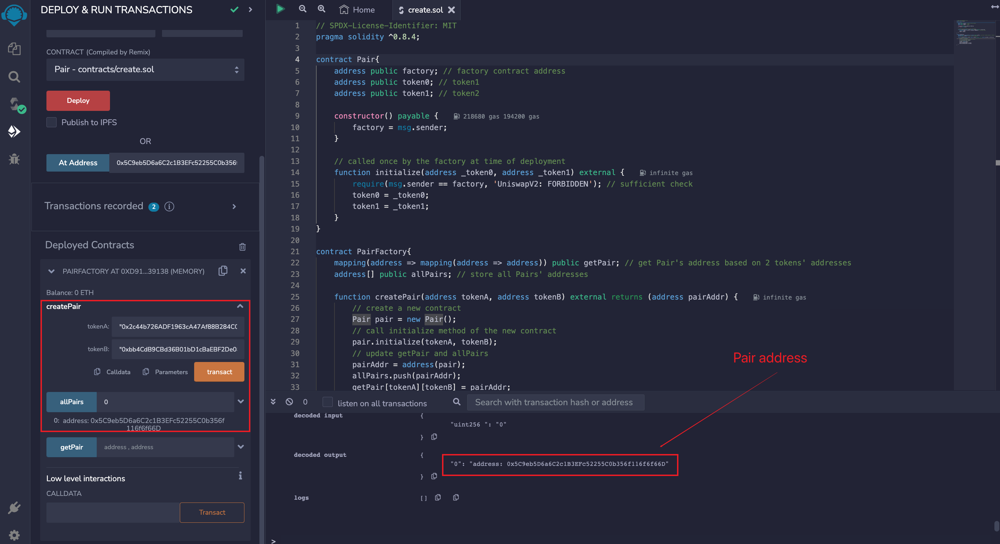

# WTF Solidity 超シンプル入門: 24. スマートコントラクトを使ってスマートコントラクトを作成する方法

最近、Solidity の学習を再開し、詳細を確認しながら「Solidity 超シンプル入門」を作っています。これは初心者向けのガイドで、プログラミングの達人向けの教材ではありません。毎週 1〜3 レッスンのペースで更新していきます。

僕のツイッター：[@0xAA_Science](https://twitter.com/0xAA_Science)｜[@WTFAcademy\_](https://twitter.com/WTFAcademy_)

コミュニティ：[Discord](https://discord.gg/5akcruXrsk)｜[Wechat](https://docs.google.com/forms/d/e/1FAIpQLSe4KGT8Sh6sJ7hedQRuIYirOoZK_85miz3dw7vA1-YjodgJ-A/viewform?usp=sf_link)｜[公式サイト wtf.academy](https://wtf.academy)

すべてのソースコードやレッスンは github にて公開: [github.com/AmazingAng/WTFSolidity](https://github.com/AmazingAng/WTFSolidity)

---

イーサリアムのブロックチェーン上では、ユーザー（外部アカウント、`EOA`）がスマートコントラクトを作成できます。

実は、スマートコントラクトを使っても新しいスマートコントラクトを作成できます。

分散型取引所`uniswap`は、ファクトリコントラクト（`PairFactory`）を使用して無数のペアコントラクト（`Pair`）を作成しています。今回のレッスンでは、簡易版の`uniswap`を使って、スマートコントラクトを使ってスマートコントラクトを作成する方法を説明します。

## `create`

スマートコントラクトを使ってスマートコントラクトを作成する方法は 2 種類あり、`create`と`create2`があります。今回は`create`を説明し、次回は`create2`を説明します。

`create`の使い方は非常に簡単です。それは新しいコントラクトを`new`するとともに、新しいコントラクトのコンストラクタに必要な引数を渡します。

```solidity
Contract x = new Contract{value: _value}(params)
```

今のコードの中で、`Contract`は作りたいコントラクト名です。`x`はコントラクトのアドレスです。もしコントラクトのコンストラクタが`payable`なら、作成時に`_value`量の`ETH`を送ることができます。`params`は新しいコントラクトのコンストラクタの引数です。

## 簡易版 Uniswap

`Uniswap V2`[コアコントラクト](https://github.com/Uniswap/v2-core/tree/master/contracts)に 2 つのコントラクトが含まれています。

1. UniswapV2Pair: トークンペアのコントラクト → 流動性、トークンペアコントラクト、売買を管理しています。
2. UniswapV2Factory: ファクトリコントラクト → 新しいトークンペアコントラクトの作成、トークンペアのアドレスを管理しています。

以下では`create`メソッドを使って、簡易版の`Uniswap`を実装します。`Pair`はペアアドレスを管理し、`PairFactory`は新しいペアを作成し、ペアアドレスを管理します。

### `Pair`コントラクト

```solidity
contract Pair {
    address public factory; // ファクトリコントラクト
    address public token0; // トークン1
    address public token1; // トークン2

    constructor() payable {
        factory = msg.sender;
    }

    // デプロイ時に一度呼ばれる初期化関数
    function initialize(address _token0, address _token1) external {
        require(msg.sender == factory, "UniswapV2: FORBIDDEN"); // sufficient check
        token0 = _token0;
        token1 = _token1;
    }
}
```

`Pari`コントラクトは非常にシンプルです。3 つの状態変数があります：`factory`、`token0`、`token1`。

コンストラクト関数`constructor`はデプロイ時に`factory`をファクトリコントラクトのアドレスに設定します。`initialize`関数はファクトリコントラクトがデプロイ直後に呼び出され、トークンアドレスを初期化し、`token0`と`token1`を更新します。

> **質問**：なぜ`uniswap`はコンストラクタの中で、`token0`と`token1`のアドレスを更新しないのですか？

> **答え**：それは`uniswap`が`create2`を使ってコントラクトを作成するため、生成されたコントラクトアドレスを予測できるためです。詳細は[第 25 回](https://github.com/AmazingAng/WTF-Solidity/blob/main/25_Create2/readme.md)を参照してください。

### `PairFactory`

```solidity
contract PairFactory {
    mapping(address => mapping(address => address)) public getPair; // トークン1, 2によってpairのアドレスを調べれるようにするマップ変数
    address[] public allPairs; // すべてのpairのアドレスを格納する配列

    function createPair(address tokenA, address tokenB) external returns (address pairAddr) {
        // 新しいPairコントラクトをデプロイする
        Pair pair = new Pair();
        // Pairコントラクトの初期化関数を呼び出す
        pair.initialize(tokenA, tokenB);
        // マップ変数を更新する
        pairAddr = address(pair);
        allPairs.push(pairAddr);
        getPair[tokenA][tokenB] = pairAddr;
        getPair[tokenB][tokenA] = pairAddr;
    }
}
```

ファクトリコントラクト(`PairFactory`)は２つの状態変数があります。`getPair`は２つのトークンアドレスからペアアドレスを取得するためのマップ変数です。`allPairs`はすべてのペアアドレスを格納する配列です。

`PairFactory`合约只有一个`createPair`函数，根据输入的两个代币地址`tokenA`和`tokenB`来创建新的`Pair`合约。其中
`PairFactory`コントラクトは一つの`createPair`関数しかありません。入力された２つのトークンアドレス`tokenA`と`tokenB`に基づいて新しい`Pair`コントラクトを作成します。
（実際のコントラクトはトークンペアの作成がすでにあるかチェックするコードがあるが、ここでは省いていると思われます）

```solidity
Pair pair = new Pair();
```

これはコントラクトを作成するコードです。非常に簡単です。`PairFactory`コントラクトをデプロイし、以下の２つのアドレスを引数として`createPair`を呼び出し、作成されたペアのアドレスを確認してみてください。

```text
WBNBアドレス: 0x2c44b726ADF1963cA47Af88B284C06f30380fC78
BSCにあるPEOPLEアドレス: 0xbb4CdB9CBd36B01bD1cBaEBF2De08d9173bc095c
```

### remix で検証する

1. `WBNB`、`PEOPLE`のアドレスを引数として`createPair`を呼び出し、`Pair`コントラクトのアドレスを取得すると、`0xD3e2008b4Da2cD6DEAF73471590fF30C86778A48`となります。

   

2. `Pair`コントラクトのアドレスを確認する

   

3. Debug して、`create`オペコードを見る

   

## まとめ

今回、私たちは簡易版の`Uniswap`の例を使って、`create`メソッドを使ってコントラクトを作成する方法を説明しました。次回は別の方法の`create2`メソッドを使って簡易版の`Uniswap`を実装します。
