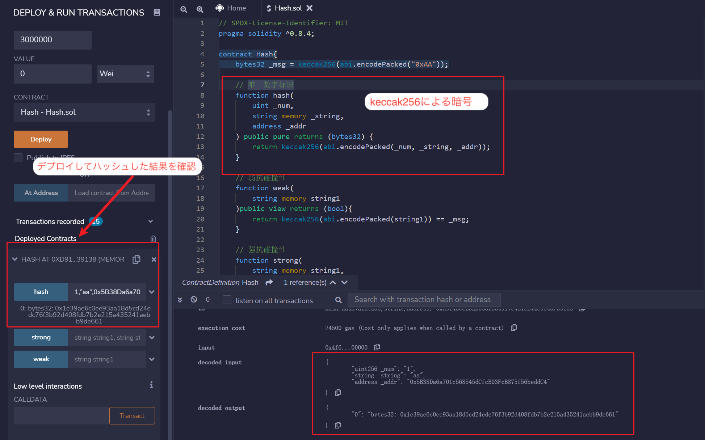
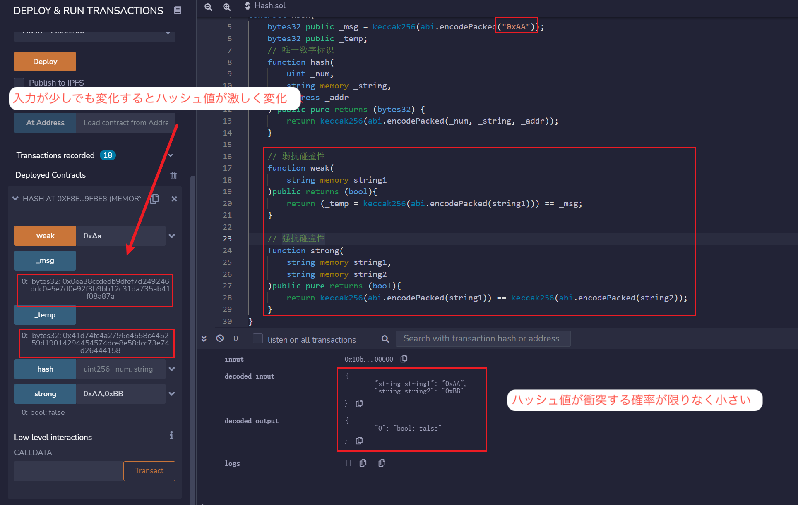

# WTF Solidity 超シンプル入門: 28. Hash

最近、Solidity の学習を再開し、詳細を確認しながら「Solidity 超シンプル入門」を作っています。これは初心者向けのガイドで、プログラミングの達人向けの教材ではありません。毎週 1〜3 レッスンのペースで更新していきます。

僕のツイッター：[@0xAA_Science](https://twitter.com/0xAA_Science)｜[@WTFAcademy\_](https://twitter.com/WTFAcademy_)

コミュニティ：[Discord](https://discord.gg/5akcruXrsk)｜[Wechat](https://docs.google.com/forms/d/e/1FAIpQLSe4KGT8Sh6sJ7hedQRuIYirOoZK_85miz3dw7vA1-YjodgJ-A/viewform?usp=sf_link)｜[公式サイト wtf.academy](https://wtf.academy)

すべてのソースコードやレッスンは github にて公開: [github.com/AmazingAng/WTFSolidity](https://github.com/AmazingAng/WTFSolidity)

---

ハッシュ関数（hash function）は暗号学の概念で、任意の長さのメッセージを固定長の値に変換することができます。この値はハッシュ値（hash）とも呼ばれます。

このレッスンでは、ハッシュ関数と`Solidity`での応用について簡単に紹介します。

## Hash の性質

よいとされるハッシュ関数は以下の性質を持つべきです：

- 単一方向性：入力のメッセージからハッシュ値への正方向の計算は簡単で一意的であるが、逆方向の計算は非常に困難であり、総当たり法でしか探ることはできない。
- 俊敏性：入力のメッセージが少し変わると、ハッシュ値が大きく変わる。
- 効率性：入力されたメッセージからハッシュへの計算は効率的ではやい。
- 均一性：各ハッシュ値が取られる確率は基本的に等しくなる。
- 衝突困難性：弱い衝突耐性：特定のメッセージ x が与えられたとき、別のメッセージ x'を見つけて hash(x) = hash(x')にすることは困難。
- 強い衝突耐性：任意の x と x'を見つけて hash(x) = hash(x')にすることは困難。

## Hash の応用

- データの一意識別
- 署名
- セキュリティ暗号

## Keccak256

`Keccak256`函数是`Solidity`中最常用的哈希函数，用法非常简单：

```solidity
哈希 = keccak256(数据);
```

### Keccak256 和 sha3

这是一个很有趣的事情：

1. sha3 由 keccak 标准化而来，在很多场合下 Keccak 和 SHA3 是同义词，但在 2015 年 8 月 SHA3 最终完成标准化时，NIST 调整了填充算法。**所以 SHA3 就和 keccak 计算的结果不一样**，这点在实际开发中要注意。
2. 以太坊在开发的时候 sha3 还在标准化中，所以采用了 keccak，所以 Ethereum 和 Solidity 智能合约代码中的 SHA3 是指 Keccak256，而不是标准的 NIST-SHA3，为了避免混淆，直接在合约代码中写成 Keccak256 是最清晰的。

### 生成数据唯一标识

我们可以利用`keccak256`来生成一些数据的唯一标识。比如我们有几个不同类型的数据：`uint`，`string`，`address`，我们可以先用`abi.encodePacked`方法将他们打包编码，然后再用`keccak256`来生成唯一标识：

```solidity
function hash(
    uint _num,
    string memory _string,
    address _addr
    ) public pure returns (bytes32) {
    return keccak256(abi.encodePacked(_num, _string, _addr));
}
```

### 弱抗碰撞性

我们用`keccak256`演示一下之前讲到的弱抗碰撞性，即给定一个消息`x`，找到另一个消息`x'`，使得`hash(x) = hash(x')`是困难的。

我们给定一个消息`0xAA`，试图去找另一个消息，使得它们的哈希值相等：

```solidity
// 弱抗碰撞性
function weak(
    string memory string1
    )public view returns (bool){
    return keccak256(abi.encodePacked(string1)) == _msg;
}
```

大家可以试个 10 次，看看能不能幸运的碰撞上。

### 强抗碰撞性

我们用`keccak256`演示一下之前讲到的强抗碰撞性，即找到任意不同的`x`和`x'`，使得`hash(x) = hash(x')`是困难的。

我们构造一个函数`strong`，接收两个不同的`string`参数`string1`和`string2`，然后判断它们的哈希是否相同：

```solidity
// 强抗碰撞性
function strong(
        string memory string1,
        string memory string2
    )public pure returns (bool){
    return keccak256(abi.encodePacked(string1)) == keccak256(abi.encodePacked(string2));
}
```

大家可以试个 10 次，看看能不能幸运的碰撞上。

## remix での検証

- コントラクトをデプロイし、ハッシュ関数を使って唯一の識別子を生成する結果を確認

  

- ハッシュ関数の感度を確認し、強い、弱い抗衝突性を確認

  

## 总结

这一讲，我们介绍了什么是哈希函数，以及如何使用`Solidity`最常用的哈希函数`keccak256`。
