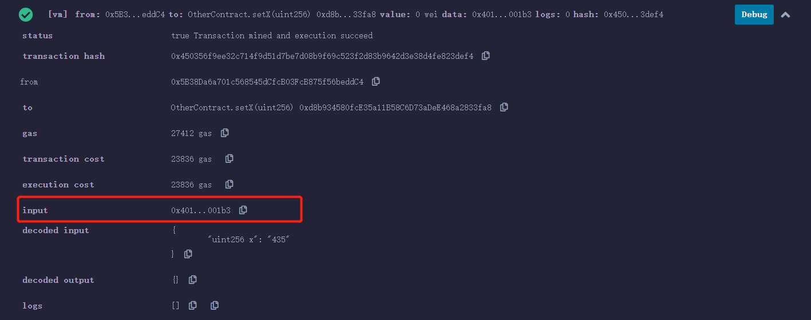

# WTF Solidity 超シンプル入門: 29. 関数のセレクタ

最近、Solidity の学習を再開し、詳細を確認しながら「Solidity 超シンプル入門」を作っています。これは初心者向けのガイドで、プログラミングの達人向けの教材ではありません。毎週 1〜3 レッスンのペースで更新していきます。

僕のツイッター：[@0xAA_Science](https://twitter.com/0xAA_Science)｜[@WTFAcademy\_](https://twitter.com/WTFAcademy_)

コミュニティ：[Discord](https://discord.gg/5akcruXrsk)｜[Wechat](https://docs.google.com/forms/d/e/1FAIpQLSe4KGT8Sh6sJ7hedQRuIYirOoZK_85miz3dw7vA1-YjodgJ-A/viewform?usp=sf_link)｜[公式サイト wtf.academy](https://wtf.academy)

すべてのソースコードやレッスンは github にて公開: [github.com/AmazingAng/WTFSolidity](https://github.com/AmazingAng/WTFSolidity)

---

## 関数セレクタ

私たちがスマートコントラクトをコールするとき、本質的にはターゲットコントラクトにただ`calldata`を送信しています。remix でトランザクションを送信すると、詳細情報の`input`に`calldata`が表示されます。



送った`calldata`の最初の 4 バイトは`selector`（関数セレクタ）です。このレッスンでは、`selector`とは何か、どのように使用するかを説明します。

### msg.data

`msg.data`は`Solidity`のグローバル変数であり、完全な`calldata`（関数呼び出し時に渡されるデータ）を表します。

以下のコードでは、`mint`関数の`calldata`を出力するために、`Log`イベントを使用しています：

```solidity
// eventがmsg.dataを返す
event Log(bytes data);

function mint(address to) external{
    emit Log(msg.data);
}
```

もし引数が`0x2c44b726ADF1963cA47Af88B284C06f30380fC78`の場合、出力される`calldata`は：

```text
0x6a6278420000000000000000000000002c44b726adf1963ca47af88b284c06f30380fc78
```

この乱雑なバイトコードは、2 つの部分に分かれます：

```text
一番前の 4 バイトは関数のセレクタ（`selector`）：
0x6a627842

その後ろの部分は32バイトのパラメータ：
0x0000000000000000000000002c44b726adf1963ca47af88b284c06f30380fc78
```

実をいうと、`calldata`はスマートコントラクトに、どの関数を呼び出すか、どのような引数を渡すかを教えているだけです。

### method id、selector と関数のシグネチャ

`method id`の定義は`関数のシグネチャ`の`Keccak`ハッシュの最初の 4 バイトであり、`selector`と`method id`が一致すると、その関数が呼び出されることを示します。では、`関数のシグネチャ`とは何でしょうか？

実はレッスン 21 では、私たちは簡単に関数のシグネチャについて紹介しました。これは`"関数名（コンマ区切りの引数型）"`です。例えば、上記のコードの`mint`関数のシグネチャは`"mint(address)"`です。同じスマートコントラクト内で、異なる関数は異なる関数シグネチャを持っており、関数シグネチャを使用してどの関数を呼び出すかを決定できます。

**注意**，関数のシグネチャにおいては、`uint`と`int`は`uint256`と`int256`として記述する必要があります。

私たちは関数を作成し、`mint`関数の`method id`が`0x6a627842`であることを検証します。以下の関数を実行して、結果を確認してください。

```solidity
function mintSelector() external pure returns(bytes4 mSelector){
    return bytes4(keccak256("mint(address)"));
}
```

その結果はまさに`0x6a627842`：


`method id`を計算するときに、関数名とパラメータの型を使います。`Solidity`では、関数のパラメータ型は主に基本型、固定長型、可変長型、マッピング型の 4 つに分類されます。

##### 基本型

`solidity`中，基础类型的参数有：`uint256`(`uint8`, ... , `uint256`)、`bool`, `address`等。在计算`method id`时，只需要计算`bytes4(keccak256("函数名(参数类型1,参数类型2,...)"))`。例如，如下函数，函数名为`elementaryParamSelector`，参数类型分别为`uint256`和`bool`。所以，只需要计算`bytes4(keccak256("elementaryParamSelector(uint256,bool)"))`便可得到此函数的`method id`。

`solidity`では、基本型のパラメーターは`uint256`(`uint8`, ..., `uint256`)、`bool`、`address`などです。`method id`を計算する際は、`bytes4(keccak256("関数名(パラメータ型1,パラメータ型2,...)"))`を使用します。例えば、以下の関数`elementaryParamSelector`のパラメータは`uint256`と`bool`です。したがって、この関数の`method id`を計算するには、`bytes4(keccak256("elementaryParamSelector(uint256,bool)"))`を使用します。

```solidity
    // elementary（基础型）タイプのパラメーターselector
    // 入力：param1: 1，param2: 0
    // elementaryParamSelector(uint256,bool) : 0x3ec37834
    function elementaryParamSelector(uint256 param1, bool param2) external returns(bytes4 selectorWithElementaryParam){
        emit SelectorEvent(this.elementaryParamSelector.selector);
        return bytes4(keccak256("elementaryParamSelector(uint256,bool)"));
    }
```

##### 固定長型

固定長型パラメーターのタイプは通常固定長の配列です。例：`uint256[5]`等。

例えば、以下の関数`fixedSizeParamSelector`のパラメータは`uint256[3]`です。したがって、この関数の`method id`を計算するには、`bytes4(keccak256("fixedSizeParamSelector(uint256[3])"))`を使用します。

```solidity
    // fixed size（固定長型）タイプのパラメーターselector
    // 入力： param1: [1,2,3]
    // fixedSizeParamSelector(uint256[3]) : 0xead6b8bd
    function fixedSizeParamSelector(uint256[3] memory param1) external returns(bytes4 selectorWithFixedSizeParam){
        emit SelectorEvent(this.fixedSizeParamSelector.selector);
        return bytes4(keccak256("fixedSizeParamSelector(uint256[3])"));
    }
```

##### 可变长度类型参数

可変長型のパラメータータイプは通常可変長の配列です。例：`address[]`、`uint8[]`、`string`等。

例えば、以下の関数`nonFixedSizeParamSelector`のパラメータは`uint256[]`と`string`です。したがって、この関数の`method id`を計算するには、`bytes4(keccak256("nonFixedSizeParamSelector(uint256[],string)"))`を使用します。

```solidity
    // non-fixed size（可変長型）タイプのパラメーターselector
    // 入力： param1: [1,2,3]， param2: "abc"
    // nonFixedSizeParamSelector(uint256[],string) : 0xf0ca01de
    function nonFixedSizeParamSelector(uint256[] memory param1,string memory param2) external returns(bytes4 selectorWithNonFixedSizeParam){
        emit SelectorEvent(this.nonFixedSizeParamSelector.selector);
        return bytes4(keccak256("nonFixedSizeParamSelector(uint256[],string)"));
    }
```

##### マッピング型のパラメータ

マッピング型のパラメーターは通常`contract`、`enum`、`struct`などです。`method id`を計算する際には、その型を`ABI`型に変換する必要があります。

例如，如下函数`mappingParamSelector`中`DemoContract`需要转化为`address`，结构体`User`需要转化为`tuple`类型`(uint256,bytes)`，枚举类型`School`需要转化为`uint8`。因此，计算该函数的`method id`的代码为`bytes4(keccak256("mappingParamSelector(address,(uint256,bytes),uint256[],uint8)"))`。

例えば、以下の関数`mappingParamSelector`のパラメータは`DemoContract`、`User`、`uint256[]`、`School`です。したがって、この関数の`method id`を計算するには、`bytes4(keccak256("mappingParamSelector(address,(uint256,bytes),uint256[],uint8)"))`を使用します。

```solidity
contract DemoContract {
    // empty contract
}

contract Selector{
    // Struct User
    struct User {
        uint256 uid;
        bytes name;
    }
    // Enum School
    enum School { SCHOOL1, SCHOOL2, SCHOOL3 }
    ...
    // mapping（マッピング）タイプのパラメーターselector
    // 输入：demo: 0x9D7f74d0C41E726EC95884E0e97Fa6129e3b5E99， user: [1, "0xa0b1"], count: [1,2,3], mySchool: 1
    // mappingParamSelector(address,(uint256,bytes),uint256[],uint8) : 0xe355b0ce
    function mappingParamSelector(DemoContract demo, User memory user, uint256[] memory count, School mySchool) external returns(bytes4 selectorWithMappingParam){
        emit SelectorEvent(this.mappingParamSelector.selector);
        return bytes4(keccak256("mappingParamSelector(address,(uint256,bytes),uint256[],uint8)"));
    }
    ...
}
```

### selector を使う

私たちは`selector`を使用してターゲット関数を呼び出すことができます。例えば、`elementaryParamSelector`関数を呼び出す場合、`elementaryParamSelector`関数の`method id`を`selector`として、引数をパックしてエンコードし、`call`関数に渡すだけです：

```solidity
    // selectorを使って関数を呼び出す
    function callWithSignature() external{
	...
        // elementaryParamSelector関数を呼び出す
        (bool success1, bytes memory data1) = address(this).call(abi.encodeWithSelector(0x3ec37834, 1, 0));
	...
    }
```

ログでは、私たちは`elementaryParamSelector`関数が呼び出され、`Log`イベントが出力されていることがわかります。


## まとめ

今回は関数セレクトとはなにか、それが`msg.data`や関数のシグネチャとの関係、そしてそれを使って関数を呼び出す方法について説明しました。
