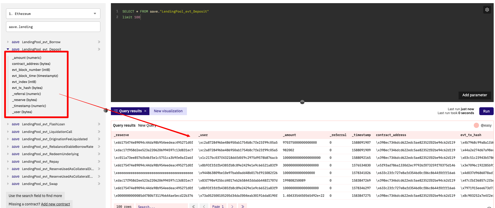
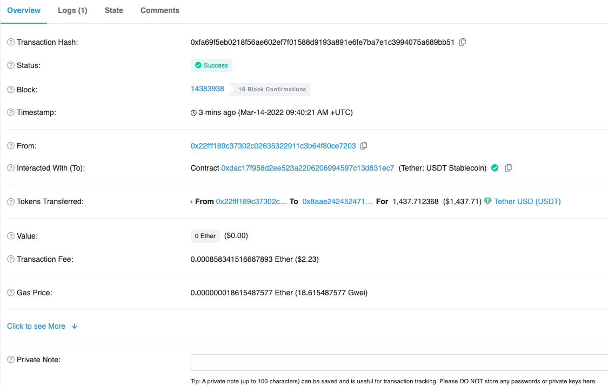
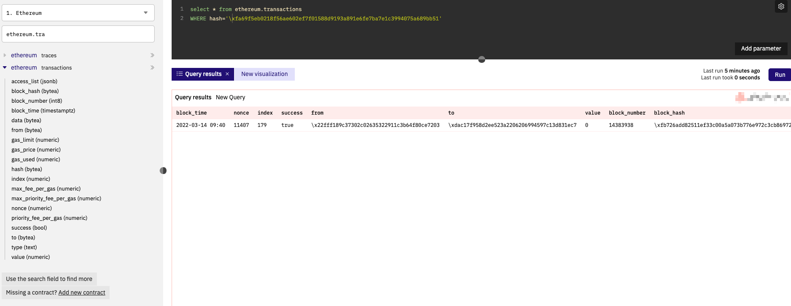

# WTF Solidity极简入门-工具篇5：使用Dune可视化区块链数据 

我最近在重新学 Solidity，巩固一下细节，也写一个“WTF Solidity极简入门”，供小白们使用（编程大佬可以另找教程），每周更新 1-3 讲。

推特：[@0xAA_Science](https://twitter.com/0xAA_Science)｜[@WTFAcademy_](https://twitter.com/WTFAcademy_)

社区：[Discord](https://discord.gg/5akcruXrsk)｜[微信群](https://docs.google.com/forms/d/e/1FAIpQLSe4KGT8Sh6sJ7hedQRuIYirOoZK_85miz3dw7vA1-YjodgJ-A/viewform?usp=sf_link)｜[官网 wtf.academy](https://wtf.academy)

所有代码和教程开源在 github: [github.com/AmazingAng/WTFSolidity](https://github.com/AmazingAng/WTFSolidity)

-----
## Dune是什么？


`Dune`是区块链查询分析工具，每个人可以通过写类sql语言查询区块链上的所有信息，例如巨鲸，链上交易的数据等等。同时`Dune`能便捷的将数据转换为可视化的图表。

> 以太坊是数据库，智能合约是数据表，来自钱包的交易是每个表中的行。

这句话讲出了区块链的精髓：区块链本质上就是公开的存储数据的分布式账本，现在我们可以通过Dune来查询这个分布式账本的数据。

[Dune官网](https://dune.xyz/)


## 第一个查询

目标：查询**过去 24 小时在 Uniswap 上购买的 DAI稳定币**

1. 注册登陆Dune。
2. 点击右上角**new query**新建查询，输入代码：

    ```sql
    SELECT
    SUM(token_a_amount) AS dai_bought
    FROM
    dex."trades"
    WHERE
    block_time > now() - interval '24 hours'
    AND token_a_symbol = 'DAI'
    AND project = 'Uniswap';
    ```
3. 点击右下角的**Run**执行查询，得到最近的24h内通过uniswap购买DAI的的数量。


## 从0开始构建查询

**目标：学会使用 SELECT, WHERE, LIMIT**

我们查询其中一个表，以aave为例：[aave合约](https://etherscan.io/address/0x398ec7346dcd622edc5ae82352f02be94c62d119#writeProxyContract)

通过查询aave这个合约，它有deposit（存储）这个方法，并且有该事件（事件会在执行的时候广播）。


回到Dune查找对应的表，根据在Ethereum上搜索aave相关的表，并对应事件,`LendingPool_evt_Deposit`找到该表。


### 学习：SELECT 、 LIMIT、WHERE查询数据

然后我们通过Dune可以查询对应的存储数据

```sql
SELECT * FROM aave."LendingPool_evt_Deposit"
limit 100
```



就可以得到aave合约中存储方法的相应数据，通过这个数据可以做一些筛选

#### 各个字段的意义

_user：发起存款的钱包地址

_reserve：作为抵押品存放的代币地址

_amount：存入的代币数量

_timestamp：交易被挖掘到区块链的时间戳


#### 使用 WHERE过滤数据

查询过滤特殊的地址`0xeeeeeeeeeeeeeeeeeeeeeeeeeeeeeeeeeeeeeeee`

```sql
SELECT *, (_amount / 1e18) as _amount FROM aave."LendingPool_evt_Deposit"
WHERE _reserve = '\xeeeeeeeeeeeeeeeeeeeeeeeeeeeeeeeeeeeeeeee'
limit 100
```

带上了查询条件，能够快速的筛选我们需要的数据

查看抵押品为USDC，USDC合约地址：`xa0b86991c6218b36c1d19d4a2e9eb0ce3606eb48`

```sql
SELECT * FROM aave."LendingPool_evt_Deposit"
WHERE _reserve = '\xa0b86991c6218b36c1d19d4a2e9eb0ce3606eb48'
limit 100
```

以上案例参考 [Your guide to basic SQL while learning Ethereum at the same time](https://towardsdatascience.com/your-guide-to-basic-sql-while-learning-ethereum-at-the-same-time-9eac17a05929)

### 实践链上转账


实践`Ethereum.Transactions`表的转账查询


```sql
select * from ethereum.transactions
LIMIT 10
```


### 字段和转账对应说明

看这个[hash](https://etherscan.io/tx/0xfa69f5eb0218f56ae602ef7f01588d9193a891e6fe7ba7e1c3994075a689bb51)转账 



由[0x22fff189c37302c02635322911c3b64f80ce7203](https://etherscan.io/token/0xdac17f958d2ee523a2206206994597c13d831ec7?a=0x22fff189c37302c02635322911c3b64f80ce7203) 转账到 [0x8aae242452471d2dfea145214ceedf87ca043198](https://etherscan.io/token/0xdac17f958d2ee523a2206206994597c13d831ec7?a=0x8aae242452471d2dfea145214ceedf87ca043198)

hash：`0xfa69f5eb0218f56ae602ef7f01588d9193a891e6fe7ba7e1c3994075a689bb51`

我们可以直接通过dune查到该条信息

```sql
select * from ethereum.transactions
WHERE hash='\xfa69f5eb0218f56ae602ef7f01588d9193a891e6fe7ba7e1c3994075a689bb51'
```



dune中的字段，也是和etherscan中一一对应。


### 数据可视化


点击 New visualization 就可以选择你需要的视图，比如我点击 `bar chart`


就会将我刚才筛选的数据可视化。看最长的几根，就是借贷最多的几个账号。


## 总结

这一讲，我们介绍了Dune的基础用法。通过Dune，我们能够将链上的数据转换为可视化的数据，更好的了解链上热点。
